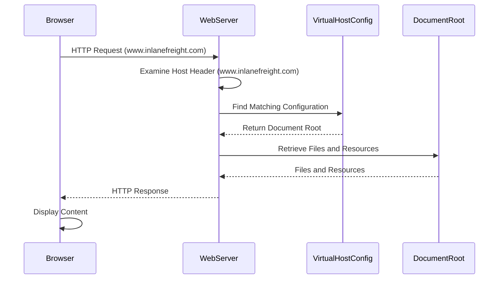

## 1. Virtual Hosts

> Once the DNS sends traffic to the right server, the web server decides how to handle incoming requests. Web servers like **Apache, Nginx, or IIS** can host multiple websites or apps on one server. They use **virtual hosting** to tell domains, subdomains, and different websites apart, ensuring each one serves the correct content.  

Virtual hosting allows web servers to handle multiple websites or apps on the same IP address. This works by using the **HTTP Host header**, which is included in every request a web browser sends. The server reads this header to deliver the right website.  

The key difference between **VHosts** and **subdomains** is how they relate to the **Domain Name System (DNS)** and web server configuration:

| Feature            | Subdomains                         | Virtual Hosts (VHosts)             |
|--------------------|----------------------------------|-----------------------------------|
| **Definition**     | Extensions of a main domain (e.g., `blog.example.com`). | Web server configurations to **host multiple sites on one server**. |
| **DNS Role**      | Have their own **DNS records**, pointing to the same or different IP as the main domain. | Can be associated with a top-level domain (`example.com`) or a subdomain (`dev.example.com`). |
| **Usage**         | Organize different sections or services of a website. | Allow separate configurations for multiple websites or applications on one server. |
| **Example**  | **Domain:** example.com<br>**Subdomain:** blog.example.com | **Host 1:** example.com<br>**Host 2:** elpmaxe.com<br>**Host 3:** realweb.com |

**Note:** When accessing a ``virtual host``, which does not have a **DNS record** (usually not possible because there is no DNS to resolve domain names), you can still access it by **modifying** the `hosts` file on your local machine (mentioned in 2.2.2 - DNS.md). The ``hosts`` file allows you to map a domain name to an IP address manually, bypassing DNS resolution (meanning ur local machine will try to access directly to set IP address you added, without asking DNS to resolve IP).

> Websites often have subdomains that are not public and won't appear in DNS records. These ``subdomains`` are only accessible internally or through specific configurations. ``VHost fuzzing`` is a technique to discover public and non-public `subdomains` and `VHosts` by testing various hostnames against a known IP address.

---
Virtual hosts can also be configured to use different domains, not just subdomains. For example:

```
# Example of name-based virtual host configuration in Apache
<VirtualHost *:80>
    ServerName www.example1.com
    DocumentRoot /var/www/example1
</VirtualHost>

<VirtualHost *:80>
    ServerName www.example2.org
    DocumentRoot /var/www/example2
</VirtualHost>

<VirtualHost *:80>
    ServerName www.another-example.net
    DocumentRoot /var/www/another-example
</VirtualHost>
```

---

**How web server (have vhosts, domain and subdomains) determines the correct content to serve based on the Host header:**



1. Browser sends request to web server.
2. Webserver receives request and checks `Host Header` in request.
3. Webserver compares Host header value with Servername and ServerAlias ​​setting in its virtual host config.
4. Once found, server returns corresponding HTTP response.

**Types of Virtual Hosting:**
- **`Name-based virtual hosting`**: uses HTTP Host Header to distinguish websites. Popular and flexible because it does not require multiple IPs. Limited to some protocols such as SSL/TLS.
- **`IP-based virtual hosting`**: Each website hosted on the server will have its own IP. The server determines which website to serve based on the IP the request is sent to. Can be used with any protocol and provides better isolation between websites. However, requires many IPs, is expensive, and is not very scalable.
- **`Port-based virtual hosting`**: Different sites are associated with different ports on the same IP. Used when IP is limited, and is not as popular or easy to use as name-based. Requires user to specify the port in the URL.

### Virtual Host Discovery Tools

Recommended tools:

| Tools | Description | Features |
| --- | --- | --- |
| ``gobuster`` | A multi-purpose tool often used for directory/file brute-forcing, but also effective for virtual host discovery. | Fast, supports multiple HTTP methods, can use custom wordlists.|
| ``ffuf`` | Another fast web fuzzer that can be used for virtual host discovery by fuzzing the `Host` header. | Customizable wordlist input and filtering options.|
| `Feroxbuster` | Similar to Gobuster, but with a Rust-based implementation, known for its speed and flexibility.| Supports recursion, wildcard discovery, and various filters.|

**Note: `gobuster` can vHost find better**

### Using gobuster

```
gobuster vhost -u http://inlanefreight.local -w /usr/share/seclists/Discovery/DNS/subdomains-top1million-20000.txt --append-domain -t 50
```

- The `-u` flag specifies the target URL (replace `<target_IP_address>` with the actual IP).
- The `-w` flag specifies the wordlist file (replace `<wordlist_file>` with the path to your wordlist).
- The `--append-domain` flag appends the base domain to each word in the wordlist.
- Consider using the `-t` flag to increase the number of threads for faster scanning.
- The `-k` flag can ignore SSL/TLS certificate errors.
- You can use the `-o` flag to save the output to a file for later analysis.

### Using ffuf

```
curl -s -I http://10.129.203.101 -H "HOST: defnotvalid.inlanefreight.local" | grep "Content-Length:"

Content-Length: 15157
```

- `ffuf -w namelist.txt:FUZZ -u http://10.129.203.101/ -H 'Host:FUZZ.inlanefreight.local' -fs 15157`
